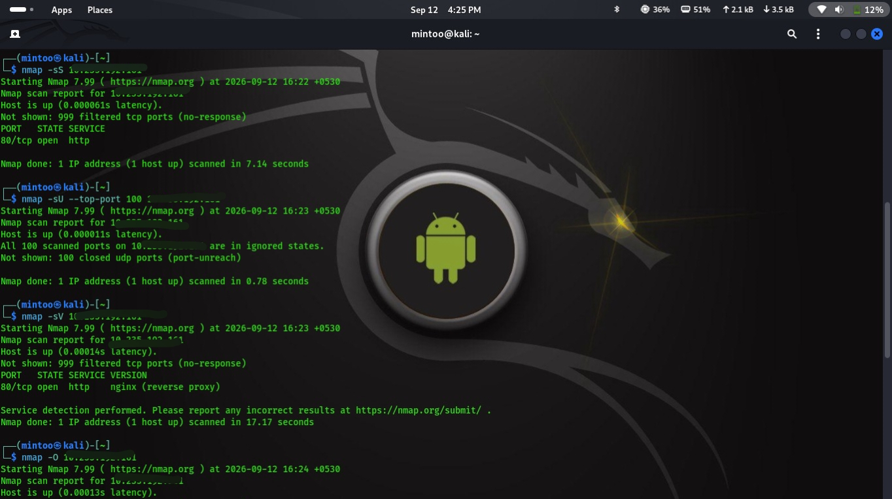
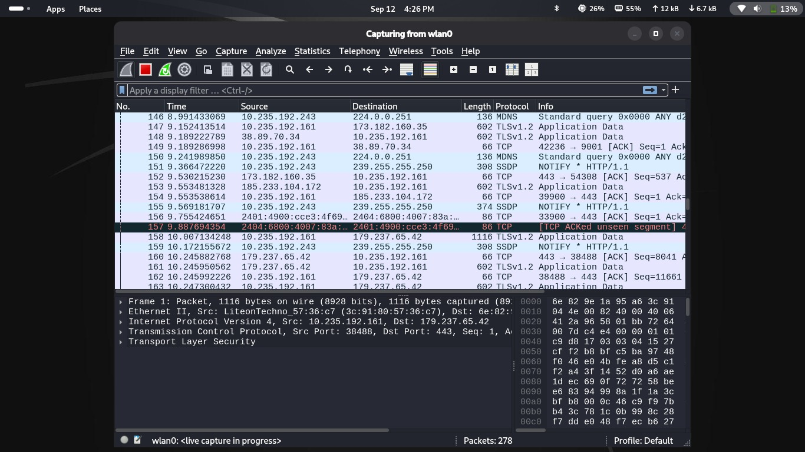

# 🔎 Nmap Network Reconnaissance

Nmap was used to perform structured reconnaissance against the authorized target.

## TCP SYN Scan

    sudo nmap -sS <AUTHORIZED_TARGET>

## UDP Scan

    sudo nmap -sU --top-ports 100 <AUTHORIZED_TARGET>

## Service & Version Detection

    nmap -sV <AUTHORIZED_TARGET>

## OS Detection

    sudo nmap -O <AUTHORIZED_TARGET>

## Comprehensive Scan

    sudo nmap -A <AUTHORIZED_TARGET>

## 📸 Nmap Scan Evidence

---

# 🦈 Wireshark Packet Analysis

Wireshark was used to capture and analyze network traffic in the authorized laboratory environment.

## 🔍 Traffic Analysis

- TCP communication
- UDP communication
- DNS requests
- HTTP traffic
- HTTPS/TLS traffic
- Potentially unencrypted communication
- Anomalous network activity

## 📸 Wireshark Analysis Evidence

---

# 📊 Findings

| Port | Protocol | Service | Version | Risk |
|------|----------|---------|---------|------|
| `<PORT>` | TCP | `<SERVICE>` | `<VERSION>` | `<RISK>` |
| `<PORT>` | TCP | `<SERVICE>` | `<VERSION>` | `<RISK>` |
| `<PORT>` | UDP | `<SERVICE>` | `<VERSION>` | `<RISK>` |

---

# 🛡️ Security Recommendations

- Disable unnecessary services.
- Close unused ports.
- Restrict exposed services using firewall rules.
- Keep services and operating systems updated.
- Use HTTPS and SSH for secure communication.
- Avoid transmitting credentials over plaintext protocols.
- Monitor unusual network traffic.
- Perform regular authorized security assessments.

---

# 📝 Conclusion

This project demonstrates network reconnaissance and traffic analysis using Nmap and Wireshark.

Nmap was used for TCP/UDP port scanning, service and version detection, and OS detection. Wireshark was used to analyze network packets and identify potentially insecure or unusual communication.

The assessment was conducted in an authorized and controlled environment for educational cybersecurity purposes.

---

# 👨‍💻 Author

## Sangeetha

**Cybersecurity Student | Ethical Hacking | Network Security**

🔐 Cybersecurity  
🌐 Network Security  
🛡️ Defensive Security  
💻 Security Research

---

# ⚠️ Ethical Disclaimer

This project is intended only for educational and authorized security testing.

Do not scan or analyze systems without explicit permission from the owner.

  <b>🔐 Learn • Analyze • Secure 🔐</b>

